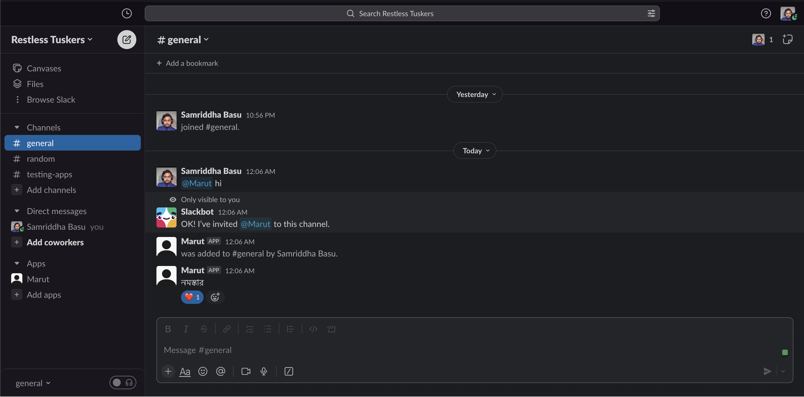
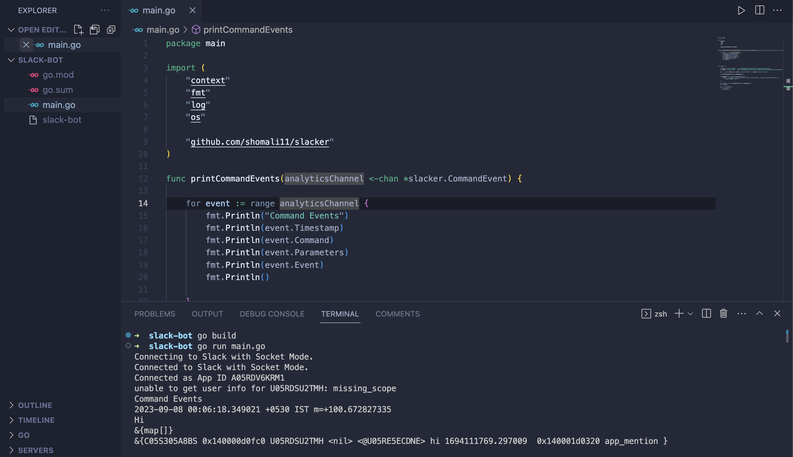

# Slack Bot with GoLang and Slack API

[](https://golang.org/)
[](https://api.slack.com/)

<p align="center">
  
  
  <br />
     Welcome to the README for our Slack bot built with GoLang and the Slack API. This bot allows you to interact with Slack using custom commands.
</p>


## Table of Contents
- [Features](#features)
- [Getting Started](#getting-started)
  - [Prerequisites](#prerequisites)
  - [Installation](#installation)
- [Usage](#usage)
- [Extending the Bot](#extending-the-bot)
- [License](#license)

## Features
- Responds with "নমস্কার" (Hello) when you send the "Hi" command in Slack.
- Easily extensible for more custom commands.
- Integration with Slack API using [github.com/shomali11/slacker](https://github.com/shomali11/slacker).

## Getting Started

### Prerequisites
- GoLang 1.21.0 or later installed.
- A Slack bot token and app token. You can obtain these from your Slack workspace.

### Installation
1. Clone the repository:
   ```bash
   git clone https://github.com/samriddha-basu-cloud/slack-bot.git
   cd slack-bot
   ```

2. Set your Slack bot and app tokens as environment variables:
   ```bash
   export SLACK_BOT_TOKEN=your_bot_token
   export SLACK_APP_TOKEN=your_app_token
   ```

3. Build and run the bot:
   ```bash
   go build
   ./slack-bot
   ```

## Usage
Once the bot is up and running, you can interact with it on Slack. For example, if you send the "Hi" command, the bot will reply with "নমস্কার" (Hello).

## Extending the Bot
You can extend this bot to perform various tasks, such as fetching weather information or answering questions using AI APIs. To do so:
- Add new command definitions to the `main` function, similar to the "Hi" command.
- Implement the desired functionality within the command's handler function.

## License
This project is open-source and is available to all for FREE. Feel free to use and modify it as needed.

Happy bot building! 🤖
